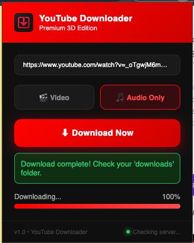
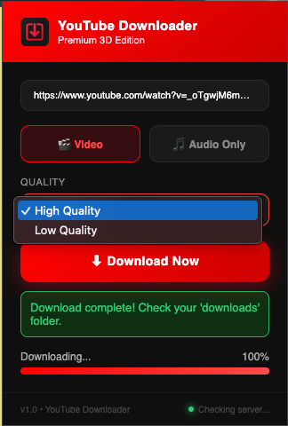
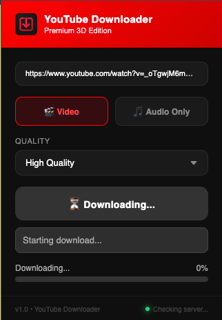

# YouTube Downloader 


## Why YouTube Downloader? (The Motivation)
This project was developed to solve the increasing complexity of web scraping and bot detection. The goal was to build a robust, full-stack solution that bypasses modern security layers while providing a premium user experience.

Building this tool helped me master:
*   **Manifest V3 Patterns:** Implementing secure, modern browser extension logic.
*   **Client Emulation:** Bypassing YouTube's bot detection by spoofing specialized player clients (Android/iOS).
*   **Backend Integration:** Coordinating a Node.js server with a browser frontend in real-time.
*   **System Optimization:** Handling high-fidelity media streams and binary file management without heavy local dependencies like FFmpeg.

## What is YouTube Downloader?
YouTube Downloader is a high-fidelity browser extension paired with a powerful Node.js backend. It provides a seamless, one-click interface for extracting videos, shorts, and audio directly from YouTube.

## Key Features
*    **Bot-Detection Bypass:** Utilizes advanced Android/iOS client emulation to ensure stable downloads even during YouTube security updates.
*    **Native Audio Extraction:** Intelligent audio grabbing that delivers high-quality MP3s without requiring local FFmpeg installation.
*    **Shorts Compatible:** Fully optimized flow for YouTube Shorts, automatically converting mobile links for backend processing.
*    **Premium 3D UI:** A sleek, glassmorphism-inspired interface with custom 3D iconography and real-time progress tracking.
*    **Smart Naming:** Automatically appends quality tags like `[High Quality]` or `[audio]` for better file organization.
*    **Real-Time Polling:** Efficient status updates from the backend to provide a smooth, responsive user experience.

## Project Showcase

| Main Interface | Quality Selection | Download Complete |
| :---: | :---: | :---: |
|  |  |  |

## Tech Stack
*   **Frontend:** Chrome Extension API (Manifest V3), HTML5, Vanilla CSS3, JavaScript (ES6+).
*   **Backend:** Node.js, Express.js, CORS.
*   **Core Engine:** `yt-dlp` (The world's most advanced media downloader).
*   **Branding:** Custom-generated 3D Glassmorphism Icons.

## Project Structure
```text
youtube-downloader/
├── youtube-downloader-extension/   (Chrome Extension)
│   ├── manifest.json               (MV3 Configuration)
│   ├── popup.html                  (Premium UI Layout)
│   ├── popup.js                    (Frontend Logic & API Polling)
│   └── logo128.png                 (Custom 3D Iconography)
└── youtube-downloader-backend/     (Node.js Server)
    ├── server.js                   (Express API & yt-dlp Logic)
    ├── package.json                (Dependencies)
    └── downloads/                  (Media storage)
```

## How to Run
To get this project running on your local machine, follow these steps:

### 1. Setup the Backend
Ensure you have [Node.js](https://nodejs.org/) and [yt-dlp](https://github.com/yt-dlp/yt-dlp) installed.
```bash
cd youtube-downloader-backend
npm install
node server.js
```
The backend will start at `http://localhost:7777`.

### 2. Install the Extension
1.  Open Chrome and navigate to `chrome://extensions`.
2.  Enable **Developer Mode** (top right).
3.  Click **Load Unpacked** and select the `youtube-downloader-extension` folder.
4.  Pin the extension to your toolbar.

### 3. Start Downloading
*   Open any YouTube Video or Short.
*   Click the Red Download Icon in your toolbar.
*   Choose your quality and click **Download Now**.

---
